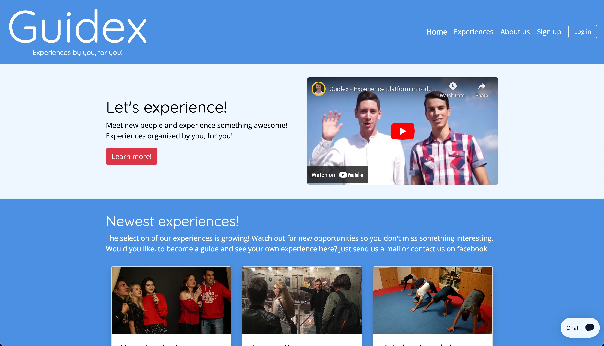

# Guidex - Platform for Guided Experiences

In the beginning of my bachelor's degree I went through a React.js course and built a prototype of a full-stack web platform that allowed users to sign up, login and book guided experiences. To save time, I leveraged Firebase providing the back-end functionality such as authentication and a real time database.

This was meant to be a platform for connecting local guides with foreigners and locals that want to experience something new. My co-founder and I organized about 10 test events and then canceled the project because of the time requirements of our university studies.

### Tech Stack

- React.js
- Firebase
- Bootstrap

👇 Click on the image below to see a demo 👇

